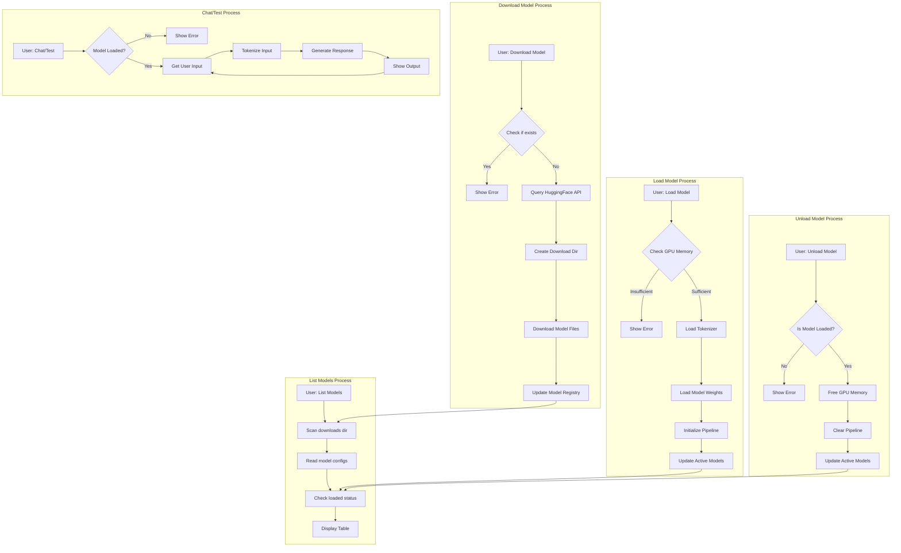

# Single Model file after download idea

**I think we could just concatenate the binary files directly with cat.**

- We could modify the download process to:
  - Download the shards as normal
  - Immediately concatenate them
  - Delete the shards
  - Update the weight map to point to the single file

## Example Code Snippet

```python
def finalize_download(model_path: str):
    """Concatenate model shards into a single file after download."""
    shards = sorted(glob.glob(os.path.join(model_path, "model-*.safetensors")))
    if not shards:
        return
        
    merged_file = os.path.join(model_path, "model.safetensors")
    shard_list = " ".join(shards)
    
    try:
        # Direct cat command - fast and efficient
        os.system(f"cat {shard_list} > {merged_file}")
        
        # Verify size
        expected_size = sum(os.path.getsize(shard) for shard in shards)
        if os.path.getsize(merged_file) == expected_size:
            # Remove shards
            for shard in shards:
                os.remove(shard)
                
            # Update weight map to point to single file
            weight_map = os.path.join(model_path, "weight_map.json")
            if os.path.exists(weight_map):
                with open(weight_map, 'r') as f:
                    wm = json.load(f)
                wm = {"model": merged_file}  # Replace with single file
                with open(weight_map, 'w') as f:
                    json.dump(wm, f)
                    
            logger.info(f"Successfully merged shards into {merged_file}")
        else:
            logger.error("Merged file size mismatch")
            os.remove(merged_file)
    except Exception as e:
        logger.error(f"Error merging shards: {e}")
        if os.path.exists(merged_file):
            os.remove(merged_file)
```

---

Here’s a reorganized and clearer version of the explanation:

---

## **Determining RoPE Frequency Base and Scaling Factor**

When using **Rotary Positional Embedding (RoPE)** in a **VRAM-efficient runtime** or extending a model’s context length, the **frequency base** (\( \omega \)) and **scaling factor** need to align with the **loaded context length** rather than the theoretical maximum. These parameters govern how positional embeddings scale with increasing token positions, ensuring optimal performance.

---

### **1. Core RoPE Parameters**

- **Frequency Base (\( \omega \))**:
  - Determines the periodicity of the sinusoidal embeddings.
  - Lower values offer finer resolution for nearby tokens, while higher values support longer contexts.
  - Adjusts with the **loaded context length** to ensure correct encoding.

- **Scaling Factor**:
  - Modifies how embeddings degrade or scale as token positions increase.
  - Ensures embeddings remain meaningful across extended contexts.

---

### **2. Calculating Frequency Base (\( \omega \))**

#### General Formula

The base frequency (\( \omega \)) is calculated relative to the **embedding dimension (\( \text{dim} \))** and the **maximum frequency (\( \text{max\_freq} \))**, often \( 10,000 \):

\[
\omega = \exp\left(\frac{\log(\text{max\_freq})}{\text{dim}/2}\right)
\]

For practical purposes:
\[
\omega = 10,000^{2 / \text{dim}}
\]

#### Adjusting for Loaded Context

If the **loaded context length (\( \text{loaded\_context} \))** is less than the model’s theoretical maximum (\( \text{max\_context} \)), adjust the frequency base using:

\[
\omega_{\text{loaded}} = \omega_{\text{max}} \cdot \sqrt{\frac{\text{loaded\_context}}{\text{max\_context}}}
\]

---

### **3. Calculating Scaling Factor**

The scaling factor determines how positional embeddings are scaled for longer contexts:

\[
\text{scale\_factor} = \sqrt{\frac{\text{base\_context}}{\text{new\_context}}}
\]

This ensures embeddings are appropriately balanced for extended or reduced contexts.

---

### **4. Example Adjustments**

#### Context Setup

- **Model’s Max Context Length**: 100,000 tokens
- **Loaded Context Length**: 32,768 tokens
- **Base Frequency for Max Context (\( \omega_{\text{max}} \))**: 10,000

#### Frequency Base (\( \omega_{\text{loaded}} \))

\[
\omega_{\text{loaded}} = 10,000 \cdot \sqrt{\frac{32,768}{100,000}}
\]
\[
\omega_{\text{loaded}} \approx 10,000 \cdot 0.573
\]
\[
\omega_{\text{loaded}} \approx 5,730
\]

#### Scaling Factor

If the **base context** is 2048 tokens and the **new context** is 32,768 tokens:
\[
\text{scale\_factor} = \sqrt{\frac{2048}{32,768}} = 0.25
\]

---

### **5. Practical Workflow**

1. **Identify Model Parameters**:
   - Determine the **embedding dimension (\( \text{dim} \))**.
   - Note the model’s **maximum context length (\( \text{max\_context} \))**.
   - Define the **loaded context length (\( \text{loaded\_context} \))**.

2. **Calculate Adjusted Frequency Base**:
   - Use the adjusted formula to align \( \omega_{\text{loaded}} \) with the loaded context.

3. **Set Scaling Factor**:
   - Apply the scaling factor to maintain balanced embeddings.

---

### **6. Tools and Validation**

- Use frameworks like **Hugging Face Transformers** or **DeepSpeed** for implementation.
- Validate by testing:
  - Model perplexity across various contexts.
  - VRAM and runtime efficiency.
- Adjust parameters iteratively based on observed performance.


### **Conclusion**

For models like Qwen2.5 with a maximum context length of 100,000 tokens, setting the **frequency base** and **scaling factor** to match the **loaded context length** (e.g., 32,768 tokens) ensures efficient and accurate RoPE embeddings. This dynamic adjustment optimizes the model’s performance without unnecessary computation.

---

## Application Flow Diagram


